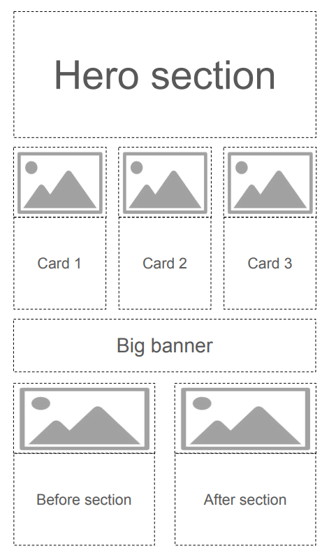

```yaml
nd-block:
  attributes:
    sectionName: blog-article-header
```

# Nodoku: a static site generator, promoting content-first approach

## Nodoku is a pure JS lo-code static site generator, based on NextJS, React, and Tailwind, which promotes a content-first approach using Markdown files.

```yaml
nd-block:
  attributes:
    sectionName: blog-article
```


Cover image and illustration: [Image by freepik](https://www.freepik.com/free-photo/high-angle-geometric-paper-objects-desk_8304459.htm#from_view=detail_alsolike) [Image by freepik](https://www.freepik.com/free-ai-image/street-market-sunset_201011260.htm#fromView=search&page=2&position=29&uuid=442c6ab3-fb62-4ffa-8d35-993d331e1098) [Image by freepik](https://www.freepik.com/free-photo/serious-mentor-leader-thinks-creative-ideas-holds-chin-looks-straightly-camera-wears-transparent-round-glasses-stands-with-notepads_12929945.htm#fromView=search&page=1&position=18&uuid=533899a2-3fba-4f4a-b549-e0bed2ce5ecf) [Image by freepik](https://www.freepik.com/free-psd/graphic-designer-mockup-desk_1269362.htm#fromView=search&page=2&position=48&uuid=446a71d7-3fb7-49ff-8efc-2cc9cb8acc44) [Image by freepik](https://www.freepik.com/free-vector/graphic-design-video-tutorial-traditional-art-internet-course-painter-online-masterclass-web-designer-distance-class-painting-e-learning-education_12083109.htm#fromView=search&page=2&position=24&uuid=1fde6f80-a37e-4dcc-b974-1d24fb77c53f) [Image by freepik](https://www.freepik.com/free-photo/3d-view-puzzle-pieces_45150207.htm#fromView=search&page=1&position=9&uuid=31847f7c-1363-4ab1-9b28-52b78ebe18a9) [Image by freepik](https://www.freepik.com/free-vector/set-different-paper-leaves_1472030.htm#fromView=search&page=1&position=18&uuid=9915a542-e271-4c60-a1e9-effca306ce2d)

Have you ever experienced the fear of a blank page? Whether it's a document, a Word file, or an important email?

Trust me, I have, and by far more than once.

This fear especially scares me - to the point of trembling in my knees! - when I have to create a landing page.

Yeah, that simple landing page for a company or a product you encounter a dozen times per minute while surfing your daily internet.

## The scariest monster - a landing page

Why is it so scary to create a landing page?

At least for meб there are many things involved because a good landing page should satisfy so many criteria:

* it should look good. Stunning, actually!

* it should convey a message, promoting your product or service. A clear message!

* and it should be concise! Because nobody would spend hours reading it through.


How would you create something like that? Especially if you are not a design agency, but a backend computer engineer with very little design knowledge (like myself).

You see examples of astonishing landing pages every day. So, as far as design is concerned, you might not have the skills, but you definitely have very high expectations!

Ironically, when it comes to landing page creation, the design is **the least** of your concerns.

Nowadays, practically every landing page online constructor offers a diverse set of carefully crafted landing page blocks, such as image cards, hero sections, and testimonies, which can easily be added to the canvas, creating the landing page of your dreams.

Now your problem is the content!

### Web forms - your worst nightmare

Indeed, all these visually appealing landing page constructors suggest that you enter text in the designated text inputs, allowing you to fill in the design skeleton with the content tailored to your needs.

In particular, they follow the well-known (and just as much criticized) WYSIWYG approach. For the young generation, WYSIWYG = <mark>What You See Is What You Get</mark>, a form of user interface when the final result is permanently shown, and the editing is done on top of that. Examples: MS Word, MS Powerpoint, popular landing page constructors.

However, this approach has several important drawbacks.

* First, I find it quite distracting to work with the content in such an environment. -

    * The landing page template comes with already prefilled text messages everywhere, such as “We invest in the world's potential” and “Grow your business with industry leader” with very shallow meaning. However, as this text is there, it greatly hinders your concentration on the subject of your landing page.

* Second, the content is bound to a particular component.

    * For example, the text you have entered in a hero section, can’t be reused (without copying/pasting) if you would like to replace this hero section with an image banner.

* And third, the content doesn’t belong to you!

    * Even if you have managed your way through the labyrinth of web forms, you are bound to this particular constructor, because it won’t let you easily export the content, so that it can be imported back into another landing page constructor.


All these environments remind me very much of a noisy and flashy oriental market, which looks delicious and magical but is, in practice, so distracting, that you would quickly forget what you are even here for.


I deliberately don’t give here any particular references to such landing page constructors, since I think you know very well what I’m talking about.

On my quest I have tried lots of landing page constructors, but none of them were fun environment to work in.

Because that was not the way I’ve been imagining a landing page creation process should look like.

## Markdown standard to the rescue

The fact that design concerns are taken out of the equation is indeed very good news. The bad news is that it is done at the expense of content management, which becomes unintuitive, cumbersome, and difficult to use.

So what if we switch the priorities?

Let’s imagine for a moment what would be the situation if content management had been set as our starting point.

First of all, there would be no web forms. It’s really difficult to imagine something less convenient to manage textual content.

Second, you would rather use a convenient editor, not like MS Word or another fancy program, but something simple and available everywhere.

Third, you would expect this content to have as few distracting metadata, which is not related to the actual content, as possible.

Aaaanndd….. the winner is…. Yah! you might have guessed already!

It’s ***Markdown***!

The Markdown is a text-file standard allowing the creation of a loosely structured text document, much like a common Word document, with titles, subtitles, lists, and other text components.

[The feature set of Markdown language](https://www.markdownguide.org/basic-syntax/) is intentionally kept quite limited to avoid over-complication of the Markdown document.

Here is a common piece of Markdown code

```markdown
# This the title of my article
## And this is the subtitle, describing briefly what the article is about

this is the first paragraph
and this is a second one

Look, I can even have lists!
- list item 1
- list item 2
- list item 3
```

Anything, that can edit text files, can be used to edit Markdown documents, from vi and emacs (do you even know what these are ?) to the most fancy editors of our times (though [Notepad++](https://notepad-plus-plus.org/) is probably a very good choice for most cases).

So ok, looks like Markdown is indeed very suitable for content creation, at least textual one. It’s distraction-free, sober, and - literally - omnipresent.

Now we need to come back to the design aspect which we have left out for the time being.

## Skinning up a Markdown file

It turns out that the rich potential of the Markdown standard for content creation has been recognized long before me, writing this article.

There are plenty of options to create static sites or blogs from Markdown files, [Jekyll](https://jekyllrb.com/docs/configuration/markdown/) and [Hugo](https://gohugo.io/), to name a few. Jamstack has created a [very convenient catalog of static site generators](https://jamstack.org/generators/), where you can select Markdown as a template to filter. And here is [another selection of static site generators](https://github.com/myles/awesome-static-generators).

In the context of static site generators for Markdown files, one needs to notice probably also [MkDocs](https://www.mkdocs.org/) - a Python-based static site generator that uses Jinja templating engine. This project proposes a selection of predefined themes. For example, [Material for MkDocs](https://github.com/squidfunk/mkdocs-material), the [landing page of which](https://squidfunk.github.io/mkdocs-material/) looks really stunning!

These tools are indeed great for building stunningly-looking pages or whole sites. Hugo for example offers more than 300 prebuilt templates, among which you would definitely find the one that would suit your needs.

However, for my purposes, none of these options was an ideal choice. Mainly because the combination of different technology stacks is not straightforward.

A landing page in my case was supposed to be a part of a larger project, written using NextJS, React and Tailwind. And I couldn’t find an acceptable way of combining a different technology stack, such as Python and Jinja, with NextJS and React.

When confronting a problem of harmonious co-existence of different technology stacks, say A and B - for example, MkDocs (A) and NextJS (B) - in a single website one would probably come up with the following straightforward options:

* include A site as a component in B site.

    * for example, generate a static site with MkDocs, and include it as a plain HTML into NextJS site

* include B site as a component in A site

    * in this case, one would use an extension capability of MkDocs (if there are any) to include into MkDocs generated site the HTML, CSS and JS, generated by NextJS

* finally one might think of a common HTML, which would include the whole sites from MkDocs and NextJS as Frame / iFrame tags.


Honestly speaking, I didn’t explore any of these options deeply because at first sight none of them looked attractive enough to deserve investing time and effort.

Finally, there are static site generators for Markdown, written entirely in JS, which should ease the integration.


However, some were intended to be used mainly for documentation, others were not maintained anymore. The few options that were left didn’t provide the required philosophy and the feature set, that I’ve been expecting.

So I have decided to create one of my own!

Tadaaamm! Please give a warm welcome fooooorrr…..

***Nodoku***

yet another JS static site generator, intended for landing pages, that uses Markdown files for content management, and NextJS, React, and Tailwind as the technology stack.

## Nodoku - philosophy and fundamental principles

Nodoku has been conceptualized as a JS engine capable of parsing the content and configuration files and performing the rendering by applying visual representation to the pieces of content. The actual rendering is delegated to visual blocks, while the engine controls the mapping of content to representation.

Nodoku has been designed to work primarily in the NextJS environment since the whole point is to create static landing pages. Thus the Nodoku components inherently are not interactive (at least for now).

The entry point of Nodoku is a JSX component - *RenderingPage* - that can be used to render the visual content. Since *RenderingPage* is a standard React JSX component, it can be used to render the whole page or only a portion of it.

The main philosophy of the Nodoku static site generator consists of a strict separation of concerns: content and design, with a heavy emphasis on the content.

The content in Nodoku is a primary concept, the point from where the whole creation process starts. Whereas the design is applied on top of the content, and cannot be used without it.

Unlike tools such as MkDocs and Hugo, Nodoku doesn’t use the templating approach (such as Jinja) at its foundation. Instead, it treats a page - in particular a landing page - as a flow of presentational blocks.

Recall, that this whole discussion has been started in the context of a landing page creation. And Nodoku is mainly intended to facilitate that process.

A landing page can be conveniently presented as a flow of visual sections, arranged in rows:




Following that representation, the landing page layout can be split into rows, each row having one or more visual blocks.

And this is exactly the foundation of Nodoku: a set of predefined representational blocks, such as Carousel, Card, or Hero section - each of which can be used on the page according to a Yaml configuration file.

Consequently, the content in the Nodoku philosophy is likewise split into blocks.

But unlike visual blocks, which can differ in their attributes, depending on their nature, the content block is standardized such that it can be used with any of the presentational blocks.

Thanks to this standardization a deeper level of separation between design and content is achieved: each presentational block can accept any content block for rendering.

### Nodoku content block

A Nodoku *content block* is a meaningful piece of information, which is represented on the page by a *visual block*. Depending on the page configuration, the same content block can be shown on the page by one or more visual blocks, but the opposite is not allowed - each instance of a visual block on the page represents exactly one content block.

As has been mentioned above, the Nodoku content block is not tailored to a particular presentational block - that would defeat the very purpose of the separation of concerns between the design and the content.

Instead, it has a strict, predefined structure, which includes the following (optional) elements:

* The title

* The sub-title

* One or more text paragraphs

* One or more images

* The footer


Each presentational block is given a set of content blocks, each having this predefined structure, and renders this content accordingly.

The flow of Nodoku content blocks is supplied in a Markdown file, where the blocks are delimited by a special Yaml code snippet (inspired by [Jekyll’s Front Matter](https://jekyllrb.com/docs/front-matter/)):

````markdown
```yaml
nd-block:
  attributes:
    sectionName: hero
```
````

Here is a sample Nodoku content Markdown file

````markdown
# Step 1: _Think_
## Create content promoting your product or service as an **MD file**


Concentrate on the subject of your product / service to highlight its advantages.

Use your *favorite* text editor to create a content-rich MD (markdown) file,
without worrying about presentation.

Using content block delimeter - a Yaml code snippet -
structure the content file, so that it can be submitted to the Nodoku parser.

|Get started|

```yaml
nd-block:
  attributes:
    sectionName: nodoku-way
```

# Step 2: _Skin_
## Skin the MD file using simple **Yaml config** and a set of available components


Once you are happy with the message your landing page conveys,
start by skinning it up.

Nodoku skin is a Yaml file, which binds together sections in your MD file,
with the presentation blocks.

You can choose among different presentation components,
including Carousel, Hero and different types of Card components.

|Get started|

```yaml
nd-block:
  attributes:
    sectionName: nodoku-way
```

# Step 3: _Fine tune_
## Use configuration options to fine tune your landing page presentation


If the default presentation doesn't suit your needs, you can tweak it up
using the config options of each component to fine tune it for your needs.

You can change the background color, text color, borders and other
visual details of your presentation.

Normally the Nodoku components support Tailwind CSS out of the box,
so you can fine tune ivsual presetnation using Tailwind.

|Get started|

```yaml
nd-block:
  attributes:
    sectionName: nodoku-way
```
````

This content file is submitted to the Nodoku parser and ultimately is transformed roughly to the following data structure - a list of objects:

```typescript
[
    {
        title: "Step 1: Think",
        subTitle: "Create content promoting your product or service as an MD file",
        paragraphs: [
            "Concentrate on the subject of your product / service.",
            ...
        ],
        footer: "Get started",
        attributes: [
            {key: "sectionName", value: "nodoku-way"}
        ]
    },
    {
        title: "Step 2: _Skin_",
        subTitle: "Skin MD file using simple Yaml config and a set of available components",
        paragraphs: [
            "Once you are happy with the message your landing page conveys, start by skinning it up.",
            ...
        ],
        footer: "Get started",
        attributes: [
            {key: "sectionName", value: "nodoku-way"}
        ]
    },
    {
        title: "Step 3: Fine tune",
        subTitle: "Use configuration options to fine tune your landing page presentation",
        paragraphs: [
            "If the default presentation doesn't suit your needs, you can tweak it up using the config options of each component to fine tune it for your needs.",
            ...
        ],
        footer: "Get started",
        attributes: [
            {key: "sectionName", value: "nodoku-way"}
        ]
    }
]
```

This flow of content blocks is being submitted to the rendering components, according to the Yaml configuration.

The Yaml configuration file, which controls the rendering of content blocks is called *skin*.

### Nodoku skin

Nodoku skin is a YAML file describing the mapping of content blocks to visual components, which perform the actual rendering.

The word *skin* has been chosen to distinguish it from the word *theme*, which has another meaning in the Nodoku terminology.

But in particular, the word *skin* best reflects the very nature of Nodoku - the content-first approach: we don’t fill in the design skeleton with the content, rather, we apply a skin on the content with the design.

We ***first*** create the content, without caring too much about the visual presentation. Then we ***skin*** this content using the set of available components.

Here is an example of a typical Nodoku skin:

```yaml
rows:
  - row:
      - flowbite/card:
          selector:
            attributes:
              sectionName: nodoku-way
```

It is a YAML file organized as a set of rows, each row having its own set of components.

All the components from the same row in the configuration are displayed on the same row on the page.

Each component in the config has its *selector -* a mandatory field describing what content blocks should be selected for the given component.

In the example, shown above, we have only one component - named ***flowbite/card*** - which should display content blocks, having the attribute *sectionName* equal to “nodoku-way”.

And here is the result:


One would notice that the content block attributes are specified as metadata in the MD file using the YAML code snippet, delimiting content blocks one from another.

Note that even though we didn’t specify 3 components in the skin, only one actually, the Nodoku engine has realized that there are 3 content blocks, matching the selector, and thus it has created 3 instances of the *flowbite/card* component to fit all the 3 content blocks, because the component in question - the flowbite/card - is capable of displaying only a one, single content block at a time.

There are other components, Carousel for example, capable of displaying an unlimited number of content blocks.

Changing the presentation from Card to Carousel in Nodoku is just a matter of a small modification of the skin YAML file - flowbite/***card*** ==&gt; flowbite/***carousel***:

```yaml
 rows:
  - row:
      - flowbite/carousel:
          selector:
            attributes:
              sectionName: nodoku-way
```

And there we go with the result:


Note how the layout of the page is changed naturally depending on the components used:

* when we used the Card component, capable of displaying only *a single* content block, we had 3 cards on the same row, to fit all the 3 matching content blocks on the same row

* whereas when we used the Carousel component, which is capable of displaying *an unlimited* number of blocks, one component on the row is enough, as it alone can fit all the matching blocks


## Putting it all together

At the moment of this article writing, Nodoku is proposed as an async JSX component suitable to be used in the NextJS environment.

As follows:

```typescript
<RenderingPage 
    content={content}
    skin={skin}
    renderingPriority={RenderingPriority.skin_first}
    componentProvider={componentProvider}
    lng={lng}
    i18nextProvider={translationServerForNodoku}
/>
```

This is a React functional component, with the following signature:

```typescript
async function RenderingPage(props: RenderingPageProps): Promise<JSX.Element>
```

where RenderingPageProps has the following form:

```typescript
class RenderingPageProps {
    lng: string;
    renderingPriority: RenderingPriority;
    i18nextProvider: I18nextProvider;
    content: NdContentBlock[];
    skin: NdPageSkin | undefined;
    componentProvider: ComponentProvider;
}
```

Here is the (very!) brief description of the attributes:

* *content*: the list of content blocks

* *skin*: the object representing the skin to be used for rendering

* *renderingPriority*: the attribute describing whether *the skin* or *the content* should take precedence during rendering

    * *content\_first*: the blocks are rendered in the order they appear in the input flow. If the skin contains a matching visual component for this content block - this visual component is used for rendering. Otherwise, a default component is used for rendering

    * *skin\_first*: the rendering of the page is done in accordance with the provided skin. The visual components are rendered in the order they appear in the skin, and following the row layout.

* *componentProvider*: the function returning visual component implementation according to the given name of the component

* *lng*: the attribute describing the language in which the page should be rendered

* *i18nextProvider*: the function providing the i18n localization


As you can see, the attribute list is quite exhaustive and provides full transparency over the inner workings of Nodoku. In particular, such aspects as i18n localization and component resolving are explicitly expressed via provided functions, thus giving the user full control.

For further details please have a look at the following resources:

* Nodoku Demo page: [https://nodoku.io/](https://nodoku.io/)

* Nodoku Demo page GitHub repository: [https://github.com/epanikas/nodoku-demo-page](https://github.com/epanikas/nodoku-demo-page)

* Nodoku Core GitHub repository: [https://github.com/nodoku/nodoku-core](https://github.com/nodoku/nodoku-core)


## Conclusion

In this article, the Nodoku static site generator has been presented.

Nodoku promotes the content-first approach with a Markdown file at its core, which serves as the content source for a web page.

This Markdown file has special delimiters - small YAML code snippets, following a predefined pattern. These YAML code snippets separate the content blocks one from another. Additionally, they convey the content block metadata, used for mapping between content blocks and their visual representation.

The visual aspect of a web page is controlled by a special YAML file, called *skin* in Nodoku terminology.

This YAML file prescribes which content blocks should be rendered with which visual components. Also, it controls the page layout by defining the composition of the page rows.

An MD file - the content - and a YAML file - the skin - together unambiguously define the web page.

In the philosophy of Nodoku, an MD file - the content - plays a leading role. For example, it can be rendered even if no skin is provided.

The skin has also very little dependency on the content. The only correlation between the skin and the content is the selectors of the visual components - small and simple data structures allowing matching between a visual block and the content block it should render.

Since the content and the skin are only loosely coupled, they can easily be modified independently one from another. For example, changing a visual representation of a content block is only a matter of a small modification of the skin file.

Nodoku is conceptualized as an embeddable React JSX component, suitable for a NextJS environment. Hence it is a convenient choice for an already existing NextJS project, which needs to have a front page (actually this is the primary use case I had in mind when designing Nodoku).

To summarize, we have presented a content-first static site generator, which is suitable for embedding in an existing project.

The Markdown file - the core source of content in Nodoku - can be edited without any distraction, allowing full concentration on the content.

The skin is a textual YAML file designed such that it would provide a result with the minimum boilerplate data included.

So… Do you still have a fear of a blank page?

If yes, we hope that with Nodoku it will be easier to overcome it!