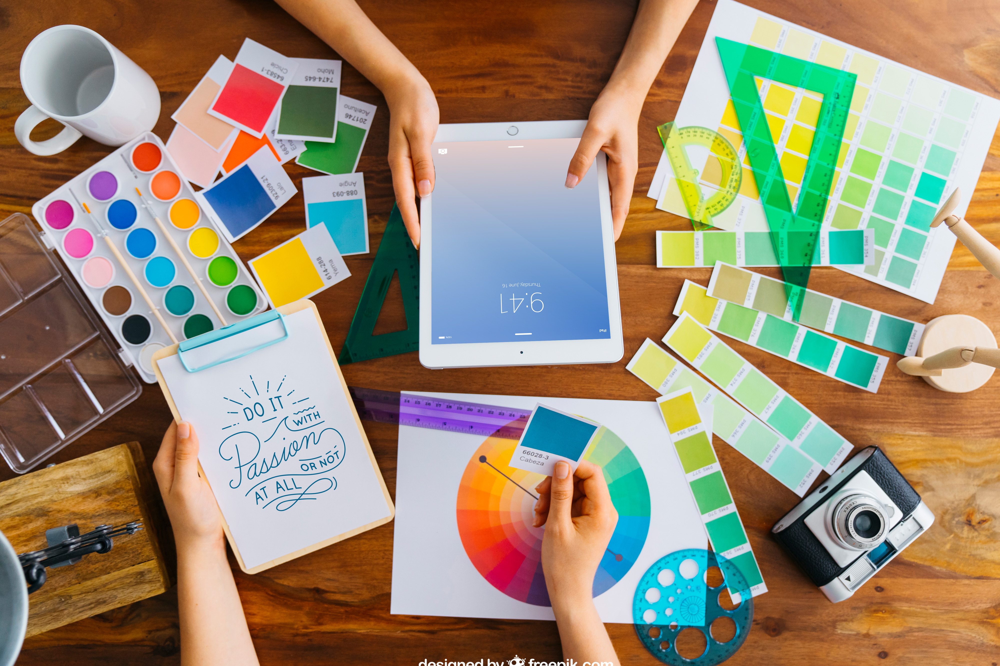

```yaml
nd-block:
  attributes:
    sectionName: components-header
```

# [MambaUI](https://mambaui.com/) based Nodoku components 

Currently, the set of Nodoku components based on MambaUI include the following elements:


```yaml
nd-block:
  attributes:
    sectionName: components-mambaui-hero-one-header
```

## MambaUI Hero One

| Category                            | Value                                                                 |
|-------------------------------------|-----------------------------------------------------------------------|
| name                                | **_mambaui/hero-one_**                                                |
| number of consumable content blocks | 1                                                                     |
| schema file location                | schemas/nodoku-mambaui/schemas/components/hero-one/visual-schema.json |
| default theme file location         | schemas/nodoku-mambaui/schemas/components/hero-one/default-theme.yml  |
| client side components              | none                                                                  |

A hero component based on one of the Mamba UI hero blocks 


```yaml
nd-block:
  attributes:
    sectionName: components-mambaui-hero-one-showcase
```

# Hero One Title

## Hero One Sub-Title

Hero One first paragraph

Hero One second paragraph

Hero One third paragraph

|[Call to action 1](/call-to-action-1)|

|[Call to action 2](/call-to-action-2)|


```yaml
nd-block:
  attributes:
    sectionName: components-mambaui-hero-two-header
```

## MambaUI Hero Two

| Category                            | Value                                                                 |
|-------------------------------------|-----------------------------------------------------------------------|
| name                                | **_mambaui/hero-two_**                                                |
| number of consumable content blocks | 1                                                                     |
| schema file location                | schemas/nodoku-mambaui/schemas/components/hero-two/visual-schema.json |
| default theme file location         | schemas/nodoku-mambaui/schemas/components/hero-two/default-theme.yml  |
| client side components              | none                                                                  |

A hero component based on one of the Mamba UI hero blocks 


```yaml
nd-block:
  attributes:
    sectionName: components-mambaui-hero-two-showcase
```

# Hero Two Title

## Hero Two Sub-Title

Hero Two first paragraph

Hero Two second paragraph

Hero Two third paragraph

|[Call to action 1](/call-to-action-1)|

|[Call to action 2](/call-to-action-2)|


```yaml
nd-block:
  attributes:
    sectionName: components-mambaui-hero-left-text-header
```

## MambaUI Hero Left-Text

| Category                            | Value                                                                 |
|-------------------------------------|-----------------------------------------------------------------------|
| name                                | **_mambaui/hero-left-text_**                                                |
| number of consumable content blocks | 1                                                                     |
| schema file location                | schemas/nodoku-mambaui/schemas/components/hero-left-text/visual-schema.json |
| default theme file location         | schemas/nodoku-mambaui/schemas/components/hero-left-text/default-theme.yml  |
| client side components              | none                                                                  |

A hero component based on one of the Mamba UI hero blocks 


```yaml
nd-block:
  attributes:
    sectionName: components-mambaui-hero-left-text-showcase
```

# Hero Left-Text Title

## Hero Left-Text Sub-Title

Hero Left-Text first paragraph

Hero Left-Text second paragraph

Hero Left-Text third paragraph


|[Call to action 1](/call-to-action-1)|

|[Call to action 2](/call-to-action-2)|


```yaml
nd-block:
  attributes:
    sectionName: components-mambaui-hero-right-text-header
```

## MambaUI Hero Right-Text

| Category                            | Value                                                                 |
|-------------------------------------|-----------------------------------------------------------------------|
| name                                | **_mambaui/hero-right-text_**                                                |
| number of consumable content blocks | 1                                                                     |
| schema file location                | schemas/nodoku-mambaui/schemas/components/hero-right-text/visual-schema.json |
| default theme file location         | schemas/nodoku-mambaui/schemas/components/hero-right-text/default-theme.yml  |
| client side components              | none                                                                  |

A hero component based on one of the Mamba UI hero blocks 


```yaml
nd-block:
  attributes:
    sectionName: components-mambaui-hero-right-text-showcase
```

# Hero Right-Text Title

## Hero Right-Text Sub-Title

Hero Right-Text first paragraph

Hero Right-Text second paragraph

Hero Right-Text third paragraph


|[Call to action 1](/call-to-action-1)|

|[Call to action 2](/call-to-action-2)|


```yaml
nd-block:
  attributes:
    sectionName: components-mambaui-footer-four-header
```

## MambaUI Footer Four

| Category                            | Value                                                                    |
|-------------------------------------|--------------------------------------------------------------------------|
| name                                | **_mambaui/footer-four_**                                                |
| number of consumable content blocks | 1                                                                        |
| schema file location                | schemas/nodoku-mambaui/schemas/components/footer-four/visual-schema.json |
| default theme file location         | schemas/nodoku-mambaui/schemas/components/footer-four/default-theme.yml  |
| client side components              | none                                                                     |

A page footer component based on one of the Mamba UI footer blocks


This component accepts one content block, which is suppposed to have the following attributes

- the H1 title element of the content block should have the predefined value "**_{Brand}_**"
- the H2 sub-title element of the content block is interpreted as a company explanation/slogan, positioned underneath the company name
- the image, found in the content block is interpreted as a company logo
- the paragraph having the following form: **_{companyName}_**Company name
  - is used to indicate the company name
- the paragraph having the following form: **_{copyrightNotice}_**copyright notice
  - is used to indicate the copyright notice that should be shown
- the list found in the content block, with sublists, designates the links of the footer


```yaml
nd-block:
  attributes:
    sectionName: components-mambaui-footer-four-showcase
```

# {Brand}

## **My-Compay** is striving to deliver the best value for our clients.


{companyName}My-Company

{copyrightNotice}© 2024 My-Company. All rights reserved.

- Product
  - [Features](/features)
  - [Integrations](/integrations)
  - [Pricing](/pricing)
  - [FAQ](/faq)
- Company
  - [Privacy](/privacy)
  - [Terms of Service](/terms-of-service)
  - [Pricing](/pricing)
  - [FAQ](/faq)
- Developers
  - [Public API](/public-api)
  - [Documentation](/docs)
  - [Guides](/guides)
- Social
  - [{icon:nd-react-icons/fa6:FaFacebook} Facebook](https://www.facebook.com/my-page/)
  - [{icon:nd-react-icons/fa6:FaInstagram} Instagram](https://www.instagram.com/my-page/)
  - [{icon:nd-react-icons/fa6:FaXTwitter} Twitter](https://www.x.com/my-page/)


```yaml
nd-block:
  attributes:
    sectionName: components-mambaui-card-header
```

## MambaUI Card

| Category                            | Value                                                                 |
|-------------------------------------|-----------------------------------------------------------------------|
| name                                | **_mambaui/card_**                                                |
| number of consumable content blocks | 1                                                                     |
| schema file location                | schemas/nodoku-mambaui/schemas/components/card/visual-schema.json |
| default theme file location         | schemas/nodoku-mambaui/schemas/components/card/default-theme.yml  |
| client side components              | none                                                                  |

A hero component based on one of the Mamba UI hero blocks 


```yaml
nd-block:
  attributes:
    sectionName: components-mambaui-card-showcase
```

# Card 1 Title

## Card 1 Sub-Title


Card 1 first paragraph

Card 1 second paragraph

Card 1 third paragraph

|[Call to action 1](/call-to-action-1)|

|[Call to action 2](/call-to-action-2)|


# Card 2 Title

## Card 2 Sub-Title


Card 2 first paragraph

Card 2 second paragraph

Card 2 third paragraph

|[Call to action 1](/call-to-action-1)|

|[Call to action 2](/call-to-action-2)|


# Card 3 Title

## Card 3 Sub-Title



Card 3 first paragraph

Card 3 second paragraph

Card 3 third paragraph

|[Call to action 1](/call-to-action-1)|

|[Call to action 2](/call-to-action-2)|


```yaml
nd-block:
  attributes:
    sectionName: components-mambaui-faq-header
```

## MambaUI FAQ

| Category                            | Value                                                                           |
|-------------------------------------|---------------------------------------------------------------------------------|
| name                                | **_mambaui/faq-header_**                                                        |
| number of consumable content blocks | 1                                                                               |
| schema file location                | schemas/nodoku-mambaui/schemas/components/mambaui/faq-header/visual-schema.json |
| default theme file location         | schemas/nodoku-mambaui/schemas/components/mambaui/faq-header/default-theme.yml  |
| client side components              | none                                                                            |

| Category                            | Value                                                                                 |
|-------------------------------------|---------------------------------------------------------------------------------------|
| name                                | **_mambaui/faq-one-question_**                                                        |
| number of consumable content blocks | 1                                                                                     |
| schema file location                | schemas/nodoku-mambaui/schemas/components/mambaui/faq-one-question/visual-schema.json |
| default theme file location         | schemas/nodoku-mambaui/schemas/components/mambaui/faq-one-question/default-theme.yml  |
| client side components              | none                                                                                  |

The Frequently Asked Questions (FAQ) components allow presenting a information in a form question - answer.

It consists of two parts:

- **_mambaui/faq-header_**: the component presenting the header of the FAQ section
  - the H1 title of the content block is shown as title of the section
  - the H2 sub-title of the content block is shown as a sub-title of the section
- **_mambaui/faq-one-question_**: this component presents exactly one content block
  - the H1 title of the content block is shown as the question
  - the rest of the content of the content block is shown as the answer

The row presenting the FAQ questions should have its parameter maxCols set to 1, to force only one column of questions.

```yaml
  - row:
      maxCols: 1
      components:
        - mambaui/faq-one-question:
            selector:
              attributes:
                sectionName: faq
```

```yaml
nd-block:
  attributes:
    sectionName: components-mambaui-faq-header-showcase
```

# Title of the questions section

## {icon:nd-react-icons/fa6:FaRegCircleQuestion} Frequently Asked Questions {icon:nd-react-icons/fa6:FaRegCircleQuestion}


```yaml
nd-block:
  attributes:
    sectionName: components-mambaui-faq-one-question-showcase
```

# Is it possible to present FAQ section with Nodoku ?

Yes, definitely.

To do this use the components:
- **_mambaui/faq-header_**
- **_mambaui/faq-one-question_**

# How many questions can be shown in the FAQ section ?

Unlimited number of questions can be shown, with just one definition of mambaui/faq-one-question component in the Yaml skin file.

Since each question can accept only one content block, Nodoku will automatically instantiate this component for each content block, found in the designated section.

The maxCols: 1 parameter on the row will prevent creating several columns for FAQ questions.